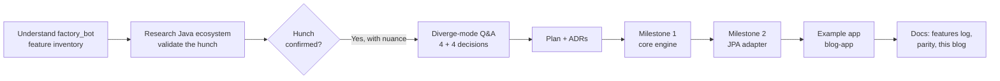
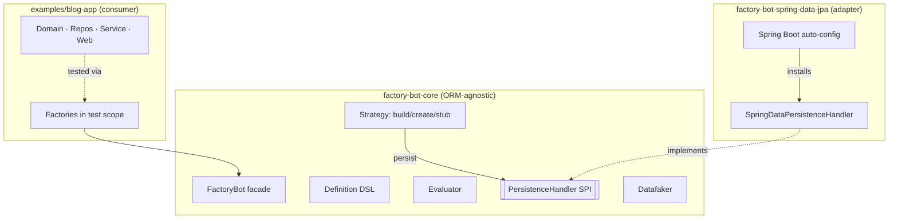
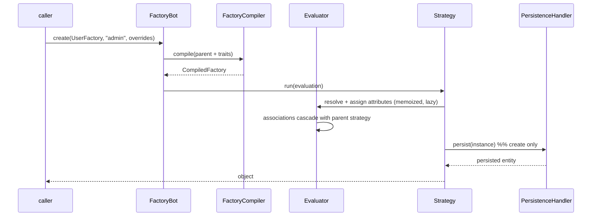

# Building factory_bot_java: from a hunch to a tested, documented library

> **Published:** 2026-07-20 · **Author:** engineering notes · **Status:** MVP (v0.1.0-SNAPSHOT)
>
> A walkthrough of *how* this project was built — the process, the decisions, the architecture, and the
> design/architecture patterns it leans on. For the terse reference, see
> [`feature-parity.md`](../feature-parity.md), the [ADRs](../decisions/), and the
> [discussion log](../discussion-log.md).

> **Repo:** <https://github.com/MonikaMahanthappa/factory_bot_java> · commit links resolve there once the
> branch is pushed. Every commit is also inspectable locally with `git show <sha>`.

---

## TL;DR

A Ruby [factory_bot](https://github.com/thoughtbot/factory_bot) maintainer asked: *does Java + Spring Boot
have a good way to create test data, or is that a real gap?* We **validated the hunch first** (it's a real
gap, with nuance), then built a **type-safe, factory_bot-style library** for Java 21 + Spring Boot with
**first-class Spring Data JPA persistence** — a clean-room engine plus a JPA adapter — and a **realistic
example app** proving it across the test pyramid. Everything is tested (25 tests) and the decision trail is
part of the repo.

---

## 1. The problem and the hunch

factory_bot makes test data declarative in Ruby: named factories with domain-meaningful defaults, traits,
associations, sequences, and `build`/`create` strategies. The hunch: **Spring Boot has no equivalent, and
the Java ecosystem's options aren't a good fit.**

Rather than assume, the working mode was **"diverge mode": validate → ask → decide → build**, with no
silent assumptions and every fork recorded.

## 2. Process: how the work actually flowed



Key process choices:

- **Validate before building.** The first work wasn't code — it was a feature inventory of Ruby factory_bot
  and a survey of the Java landscape.
- **Decisions are artifacts.** Each major fork became an [ADR](../decisions/); the running narrative lives
  in the [discussion log](../discussion-log.md). This is deliberate: design provenance is a deliverable.
- **Milestoned, test-first-ish delivery.** Core engine (build-only) → JPA adapter (`create`) → example app,
  each landing green before the next.

## 3. Research: was the hunch right?

Confirmed, with nuance. The Java test-data world splits into two camps, and neither is a live, idiomatic
factory_bot:

| Tool | Why it isn't the thing |
|---|---|
| [Instancio](https://www.instancio.org/), EasyRandom, Podam | **Random-first** population — not declarative named factories with traits/associations |
| [java-factory-bot](https://github.com/topicusoverheid/java-factory-bot) | Closest port, but **Groovy, v0.2.0, unmaintained**, no Spring Data/JPA |
| fixture-factory, Beanmother | Older template/YAML tools; not idiomatic modern Spring Boot |
| Spring default advice | Hand-rolled Object Mother + Builder, `@Sql`, `@DataJpaTest` — no library |

**The gap:** an actively-maintained, **type-safe** library with factory_bot's declarative model *and*
first-class JPA persistence. Full analysis: [ADR-0001](../decisions/0001-why-build-this.md).

## 4. Architecture

A **ports-and-adapters** shape enforced by a **multi-module** layout: the engine knows nothing about JPA;
persistence is a plug-in behind an SPI.



The seam is the Java analogue of factory_bot's `to_create(&:save!)`: everything routes through the
`PersistenceHandler` SPI, so build-only users never pull Spring/JPA
([ADR-0004](../decisions/0004-first-class-spring-data-jpa.md)).

## 5. Design: the type-safe DSL

The signature design decision ([ADR-0003](../decisions/0003-type-safe-fluent-dsl.md)): recover attribute
names from **method references** so the DSL is type-safe *and* free of string keys.

```java
f.attr(User::setFirstName, () -> faker().name().firstName());
f.attr(User::setEmail, ev ->
    ev.get(User::getFirstName) + "." + ev.get(User::getLastName) + "@example.com"); // dependent, no strings
```

`User::setFirstName` is introspected via `SerializedLambda` → property `"firstName"`, cached per call-site.
That single technique is what lets a *dependent* attribute reference another attribute's resolved value
(`ev.get(User::getFirstName)`) with compile-time safety — the crux of porting factory_bot's dynamic model
into a static language.

### The build lifecycle



## 6. Design patterns used

| Pattern | Where | Why |
|---|---|---|
| **Strategy** | `Strategy` enum (`BUILD`/`CREATE`/`STUB`) | swap the build lifecycle; each also declares its association-cascade strategy |
| **Template Method** | `Factory<T>.define(Definition)` | subclasses fill in the definition; the engine drives the algorithm |
| **Builder (fluent)** | `Definition`, `Attributes` | declarative, chainable, type-safe construction of factories & overrides |
| **Abstract Factory / Registry** | `FactoryRegistry`, lazy instantiation | resolve factories by class; one cached instance each |
| **Adapter + SPI** | `PersistenceHandler` ← `SpringDataPersistenceHandler` | decouple the engine from any ORM; JPA is one adapter |
| **Facade** | `FactoryBot` | one small surface (`build`/`create`/`buildStubbed`/…) over the whole engine |
| **Singleton** | `FactoryBot` instance | one global registry/config, mirroring Ruby's `FactoryBot` module |
| **Memoization / lazy evaluation** | `Evaluator` cache + cycle detection | consistent per-build values; dependent attributes resolve on demand |
| **Object Mother + Test Data Builder** | the factory concept itself | named, meaningful defaults (Mother) with per-call overrides (Builder) |
| **Null Object (of sorts)** | `PersistenceHandler.BUILD_ONLY` | core has a safe default that fails loudly only on `create` |

## 7. Architecture patterns used

| Pattern | Where |
|---|---|
| **Ports & Adapters (Hexagonal)** | core engine (domain) + `PersistenceHandler` port + JPA adapter |
| **Multi-module separation** | `factory-bot-core` / `factory-bot-spring-data-jpa` / `examples/blog-app` |
| **Convention over configuration / Auto-configuration** | `FactoryBotJpaAutoConfiguration` installs the handler automatically |
| **Layered architecture** | example app: `domain` → `repository` → `service` → `web` |
| **Test pyramid** | slice (`@DataJpaTest`) → service (`@SpringBootTest`) → web (MockMvc) |
| **ADR (Architecture Decision Records)** | `docs/decisions/` — one file per fork |

## 8. The example app: proof, not slideware

[`examples/blog-app`](../../examples/blog-app/README.md) is a real Spring Boot service — authors write
draft articles, publish them, and readers comment *only on published articles*. Its tests use the library
to arrange state in one line each, at every layer, against **Postgres via Testcontainers**. The app also
runs locally on H2; the workflow (including `409` when commenting on a draft, `201` after publishing) was
verified end-to-end over HTTP.

This doubles as an integration test: because it depends on the library via `project(...)`, any breaking
change to the engine breaks the example's build.

## 9. Commits

| Commit | What landed |
|---|---|
| [`551b7e7`](https://github.com/MonikaMahanthappa/factory_bot_java/commit/551b7e785557ad47f6fc26b6ebe863d4883627d4) | Core engine + Spring Data JPA adapter MVP (18 tests) |
| [`00bd452`](https://github.com/MonikaMahanthappa/factory_bot_java/commit/00bd4526078a60a2c0b03d34e0c1b3abf7eb088c) | Append-on-add feature log + project `CLAUDE.md` |
| [`9f61272`](https://github.com/MonikaMahanthappa/factory_bot_java/commit/9f612728662894f6e3cc75d40dc3d67d0635b4da) | `examples/blog-app` — Spring Boot app using factory_bot_java (7 tests) |

*(Links resolve on GitHub once the branch is pushed; inspect locally anytime with `git show <sha>`.)*

## 10. Lessons & what's next

- **Validate first paid off:** the nuance (libraries exist, but none fills this niche while alive and
  idiomatic) shaped the whole positioning — declarative, not random-first.
- **One technique unlocked the port:** method-reference introspection reconciled type-safety with
  factory_bot's dynamic attribute references.
- **The SPI seam kept core clean:** `create` persistence is a plug-in, not a dependency.

Planned: `FactoryBot.lint()`, `build_stubbed` id/timestamp faking, factory aliases + FK interruption, enum
traits, classpath factory discovery, and Maven Central publication. Tracked in
[`feature-parity.md`](../feature-parity.md).
